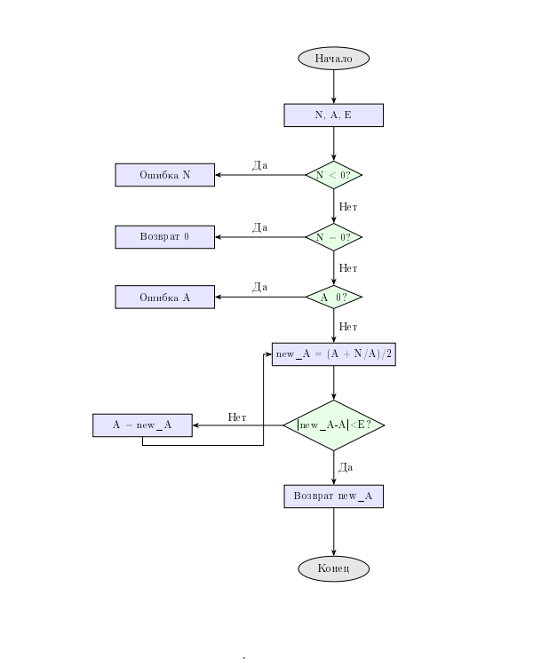

---
jupyter:
  jupytext:
    text_representation:
      extension: .md
      format_name: markdown
      format_version: '1.3'
      jupytext_version: 1.17.3
  kernelspec:
    display_name: Python 3 (ipykernel)
    language: python
    name: python3
---

# Итеративные и рекурсивные алгоритмы


## Цель работы


Изучить рекурсивные алгоритмы и рекурсивные структуры данных; научиться проводить анализ итеративных и рекурсивных процедур; исследовать эффективность итеративных и рекурсивных процедур при реализации на ПЭВМ.


### Задание 1(Рекурсивная реализация)


 Рекурсивное вычисление квадратного корня методом Ньютона
    
    Args:
        N: число, из которого извлекается корень
        A: начальное приближение
        E: допустимая погрешность
    
    Returns:
        float: приближенное значение квадратного корня
   

```python
import math
import time
from functools import wraps

def sqrt_recursive(N, A, E):
    if N < 0:
        raise ValueError("N должно быть неотрицательным")
    if N == 0:
        return 0.0
    if A <= 0:
        raise ValueError("A должно быть положительным")
    
    """Новое приближение по формуле Ньютона"""
    new_A = (A + N / A) / 2
    
    if abs(new_A - A) < E:
        return new_A
    
    return sqrt_recursive(N, new_A, E)

print("Введите число для извлечения квадратного корня:")
N = float(input())
print("Введите начальное приближение:")
A = float(input())
print("Введите точность вычисления:")
E = float(input())

try:
    result = sqrt_recursive(N, A, E)
    print(f"Квадратный корень из {N} с точностью {E}:")
    print(f"Результат: {result}")
    print(f"Проверка: {result} * {result} = {result * result}")
except ValueError as e:
    print(f"Ошибка: {e}")
```

### Задание 2 (Итеративная реализация (без рекурсии))

```python
def sqrt_iterative(N, A, E):
    if N < 0:
        raise ValueError("N должно быть неотрицательным")
    if N == 0:
        return 0.0
    if A <= 0:
        raise ValueError("A должно быть положительным")
    
    current_A = A
    while True:
        new_A = (current_A + N / current_A) / 2
        if abs(new_A - current_A) < E:
            return new_A
        current_A = new_A

print("Введите число для извлечения квадратного корня:")
N = float(input())
print("Введите начальное приближение:")
A = float(input())
print("Введите точность вычисления:")
E = float(input())

try:
    result = sqrt_iterative(N, A, E)
    print(f"Квадратный корень из {N} с точностью {E}:")
    print(f"Результат: {result}")
    print(f"Проверка: {result} * {result} = {result * result}")
except ValueError as e:
    print(f"Ошибка: {e}")
```

### Задание 3




```python
import sys
import time
from functools import wraps
from typing import List, Dict, Any

class SqrtStats:
    def __init__(self):
        self.iterations = 0
        self.max_stack_depth = 0
        self.execution_time = 0
        self.intermediate_results = []
    
    def reset(self):
        self.iterations = 0
        self.max_stack_depth = 0
        self.execution_time = 0
        self.intermediate_results = []

stats = SqrtStats()

"""Декоратор для сохранения промежуточных результатов рекурсии"""
def save_intermediate_results(func):
    @wraps(func)
    def wrapper(N, A, E, depth=0):
        stats.iterations += 1
        stats.max_stack_depth = max(stats.max_stack_depth, depth)
        
        intermediate = {
            'depth': depth,
            'N': N,
            'A': A,
            'E': E,
            'timestamp': time.time()
        }
        
        result = func(N, A, E, depth)
        
        intermediate['result'] = result
        stats.intermediate_results.append(intermediate)
        
        return result
    return wrapper

""" Рекурсивная реализация с ручным сохранением промежуточных результатов"""
def manual_sqrt_recursive_with_storage(N, A, E):
    intermediate_results = []
    stack_depth = 0
    
    def recursive_helper(n, a, e, depth):
        nonlocal stack_depth
        stack_depth = max(stack_depth, depth)
        stats.iterations += 1
        
        intermediate_results.append({
            'depth': depth,
            'N': n,
            'A': a,
            'E': e,
            'action': 'before_calculation'
        })
        
        if n < 0:
            raise ValueError("N должно быть неотрицательным")
        if n == 0:
            result = 0.0
            intermediate_results.append({
                'depth': depth,
                'result': result,
                'action': 'base_case_zero'
            })
            return result
        if a <= 0:
            raise ValueError("A должно быть положительным")
        
        new_A = (a + n / a) / 2
        
        intermediate_results.append({
            'depth': depth,
            'current_A': a,
            'new_A': new_A,
            'error': abs(new_A - a),
            'action': 'calculation'
        })
        
        if abs(new_A - a) < e:
            intermediate_results.append({
                'depth': depth,
                'result': new_A,
                'action': 'base_case_precision'
            })
            return new_A
        
        recursive_result = recursive_helper(n, new_A, e, depth + 1)
        
        intermediate_results.append({
            'depth': depth,
            'final_result': recursive_result,
            'action': 'after_recursion'
        })
        
        return recursive_result
    
    result = recursive_helper(N, A, E, 0)
    stats.max_stack_depth = stack_depth
    stats.intermediate_results = intermediate_results
    return result

""" Рекурсивный алгоритм с декоратором для сохранения промежуточных результатов"""
@save_intermediate_results
def sqrt_recursive_decorated(N, A, E, depth=0):
    if N < 0:
        raise ValueError("N должно быть неотрицательным")
    if N == 0:
        return 0.0
    if A <= 0:
        raise ValueError("A должно быть положительным")
    
    new_A = (A + N / A) / 2
    
    if abs(new_A - A) < E:
        return new_A
    
    return sqrt_recursive_decorated(N, new_A, E, depth + 1)

"""  Итеративный алгоритм со сбором статистики """ 
def sqrt_iterative_with_stats(N, A, E):
    stats.reset()
    start_time = time.time()
    
    if N < 0:
        raise ValueError("N должно быть неотрицательным")
    if N == 0:
        stats.execution_time = time.time() - start_time
        return 0.0
    if A <= 0:
        raise ValueError("A должно быть положительным")
    
    current_A = A
    iteration = 0
    
    while True:
        iteration += 1
        stats.iterations = iteration
        
        new_A = (current_A + N / current_A) / 2
        
        stats.intermediate_results.append({
            'iteration': iteration,
            'current_A': current_A,
            'new_A': new_A,
            'error': abs(new_A - current_A),
            'N': N,
            'E': E
        })
        
        if abs(new_A - current_A) < E:
            break
            
        current_A = new_A
    
    stats.execution_time = time.time() - start_time
    return new_A

""" Анализ максимальной глубины рекурсии """
def analyze_sqrt_stack_limit():
    original_limit = sys.getrecursionlimit()
    print(f"Текущий лимит рекурсии: {original_limit}")
    
    max_safe_iterations = 0
    
    for i in range(original_limit - 100):
        try:
            """ Тестируем с очень маленькой точностью для максимального количества итераций"""
            sqrt_recursive_decorated(2, 1, 1e-300)
            max_safe_iterations = i
        except RecursionError:
            break
    
    return max_safe_iterations, original_limit

""" Сравнение производительности алгоритмов"""
def sqrt_performance_comparison(test_cases):
    results = []
    
    for N, A, E in test_cases:
        print(f"\nТестирование sqrt({N}) с A={A}, E={E}:")
        
        """Рекурсивный с декоратором"""
        stats.reset()
        start_time = time.time()
        try:
            result1 = sqrt_recursive_decorated(N, A, E)
            recursive_time = time.time() - start_time
            print(f"Рекурсивный (с декоратором): {result1:.10f}")
            print(f"  Время: {recursive_time:.6f}с, Итерации: {stats.iterations}, Глубина стека: {stats.max_stack_depth}")
        except Exception as e:
            print(f"Рекурсивный (с декоратором): Ошибка - {e}")
            recursive_time = float('inf')
        
        """ Рекурсивный с ручным сохранением """
        stats.reset()
        start_time = time.time()
        try:
            result2 = manual_sqrt_recursive_with_storage(N, A, E)
            manual_recursive_time = time.time() - start_time
            print(f"Рекурсивный (ручное сохранение): {result2:.10f}")
            print(f"  Время: {manual_recursive_time:.6f}с, Итерации: {stats.iterations}, Глубина стека: {stats.max_stack_depth}")
        except Exception as e:
            print(f"Рекурсивный (ручное сохранение): Ошибка - {e}")
            manual_recursive_time = float('inf')
        
        """ Итеративный"""
        stats.reset()
        try:
            result3 = sqrt_iterative_with_stats(N, A, E)
            iterative_time = stats.execution_time
            print(f"Итеративный: {result3:.10f}")
            print(f"  Время: {iterative_time:.6f}с, Итерации: {stats.iterations}")
        except Exception as e:
            print(f"Итеративный: Ошибка - {e}")
            iterative_time = float('inf')
        
        """ Проверка совпадения результатов """
        try:
            if abs(result1 - result2) < E and abs(result2 - result3) < E:
                print(" Все алгоритмы дали одинаковый результат")
            else:
                print(" Ошибка: результаты различаются")
        except:
            print(" Невозможно сравнить результаты из-за ошибок")
        
        results.append({
            'N': N,
            'A': A,
            'E': E,
            'recursive_time': recursive_time,
            'manual_recursive_time': manual_recursive_time,
            'iterative_time': iterative_time,
            'recursive_iterations': stats.iterations,
            'stack_depth': stats.max_stack_depth
        })
    
    return results

""" Вывод сохраненных промежуточных результатов """
def print_sqrt_intermediate_results():
    print("\nПромежуточные результаты (последний вызов):")
    for i, result in enumerate(stats.intermediate_results[-10:]):
        print(f"  {i+1}: {result}")

# Итог:
print("=" * 60)
print("АНАЛИЗ АЛГОРИТМОВ ВЫЧИСЛЕНИЯ КВАДРАТНОГО КОРНЯ")
print("=" * 60)

print("\n1. АНАЛИЗ ОГРАНИЧЕНИЙ РЕКУРСИИ")
max_safe_iterations, recursion_limit = analyze_sqrt_stack_limit()
print(f"Максимальное безопасное количество итераций: {max_safe_iterations}")
    
test_cases = [
    (25, 5, 1e-10),
    (2, 1, 1e-10),
    (100, 10, 1e-12),
    (1000, 30, 1e-8),
    (0.25, 0.5, 1e-10),
    (1, 1, 1e-15)
]
    
print("\n2. СРАВНЕНИЕ ПРОИЗВОДИТЕЛЬНОСТИ")
results = sqrt_performance_comparison(test_cases)
    
print("\n3. СВОДНАЯ СТАТИСТИКА")
print("Алгоритм           | Среднее время | Макс. итераций | Макс. глубина")
print("-" * 70)
    
""" Фильтруем успешные выполнения """
successful_results = [r for r in results if r['recursive_time'] != float('inf')]
    
if successful_results:
    recursive_times = [r['recursive_time'] for r in successful_results]
    manual_times = [r['manual_recursive_time'] for r in successful_results]
    iterative_times = [r['iterative_time'] for r in successful_results]
    
    print(f"Рекурсивный        | {sum(recursive_times)/len(recursive_times):.6f}с    | {max(r['recursive_iterations'] for r in successful_results):<13} | {max(r['stack_depth'] for r in successful_results)}")
    print(f"Ручной рекурсивный | {sum(manual_times)/len(manual_times):.6f}с    | {max(r['recursive_iterations'] for r in successful_results):<13} | {max(r['stack_depth'] for r in successful_results)}")
    print(f"Итеративный        | {sum(iterative_times)/len(iterative_times):.6f}с    | {max(r['recursive_iterations'] for r in successful_results):<13} | -")
else:
    print("Нет успешных выполнений для сравнения")
    
print("\n4. ДЕМОНСТРАЦИЯ ПРОМЕЖУТОЧНЫХ РЕЗУЛЬТАТОВ")
stats.reset()
try:
    sqrt_recursive_decorated(25, 5, 1e-10)
    print_sqrt_intermediate_results()
except Exception as e:
    print(f"Ошибка при демонстрации: {e}")
```

```python

```
